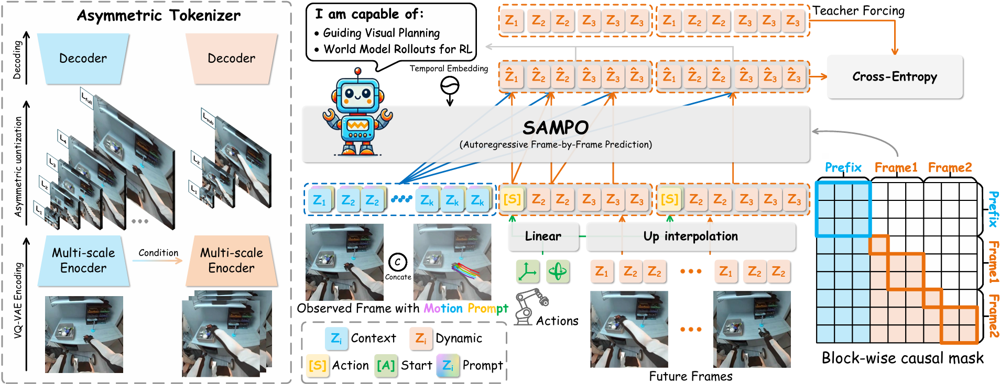
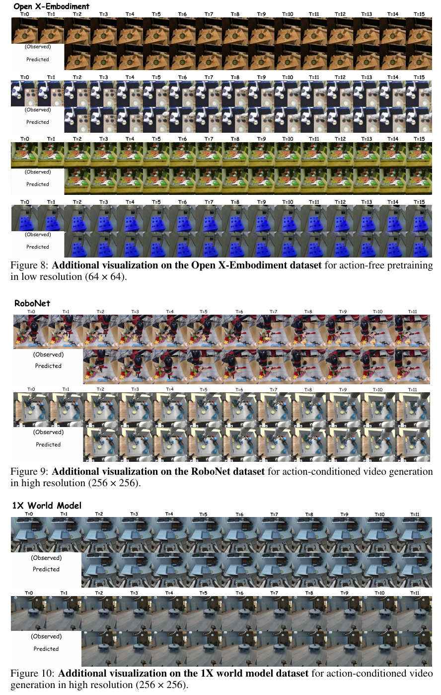
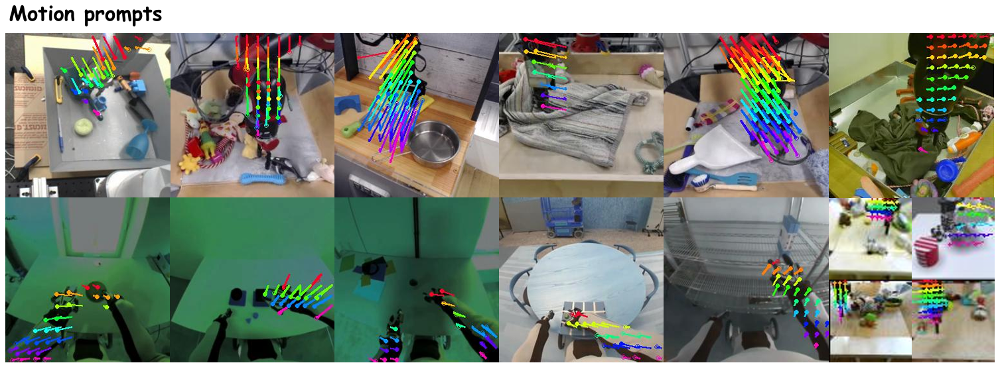

# 🤖【NeurIPS 2025】SAMPO: Scale-wise Autoregression with Motion Prompt for Generative World Models
[](https://sanmumumu.github.io/SAMPO/)&nbsp;
[](https://arxiv.org/abs/2509.15536)&nbsp;
[](https://huggingface.co/collections/wsmumumu/sampo)&nbsp;



SAMPO is a scale-wise autoregressive world model for video prediction and robotic control. It models temporal dynamics through frame-wise causal generation, while capturing spatial structure via multi-scale tokenization and coarse-to-fine prediction. A trajectory-aware motion prompt further enhances spatiotemporal grounding. SAMPO supports high-fidelity, action-conditioned rollouts for visual planning and model-based reinforcement learning.


## ⚙️ Installation

```bash
conda create -n SAMPO python==3.9
conda activate SAMPO
pip install -r requirements.txt
```
🔥 <span style="color:red; font-weight:bold;">Note:</span>
 You need replace the `diffusers/models/autoencoders/vae.py` file with the one in `SAMPO-main/SAMPO/vae_2/vae.py` to use the [`VectorQuantizer2`](/SAMPO-main/SAMPO/vq_model) version of SAMPO.
```bash
cp SAMPO-main/SAMPO/vae_2/vae.py envs/SAMPO/lib/python3.9/site-packages/diffusers/models/autoencoders/vae.py
```

To evaluate the FVD metric, download the [pretrained I3D model](https://www.dropbox.com/s/ge9e5ujwgetktms/i3d_torchscript.pt?dl=1) into `pretrained_models/i3d/i3d_torchscript.pt`.

## 🔩 Installation CoTracker

```bash
git clone https://github.com/facebookresearch/co-tracker
cd co-tracker
pip install -e .
pip install matplotlib flow_vis tqdm tensorboard
```
Download the pretrained CoTracker model:
```bash
mkdir -p checkpoints
cd checkpoints
# download the online (multi window) model
wget https://huggingface.co/facebook/cotracker3/resolve/main/scaled_online.pth
cd ..
```


## 🤗 Models
Detail in [Huggingface Model Hub.](https://huggingface.co/collections/wsmumumu/sampo)


## 📦 Data Preparation
### **Open X-Embodiment:**
Download datasets from [Open X-Embodiment](https://github.com/google-deepmind/open_x_embodiment) and extract single episodes as `.npz` files:

```bash
python datasets/oxe_data_converter.py --dataset_name {dataset name, e.g. bridge} --input_path {path to downloaded OXE} --output_path {path to stored npz}
```

To replicate our pre-training on OXE, you need to extract all datasets listed under `OXE_SELECT` in `SAMPO/data/dataset_mixes.py`.

See instructions at [`datasets`](/datasets) on preprocessing more datasets.

### **1X World Model:**
Download datasets from [1X World Mode](https://huggingface.co/datasets/1x-technologies/world_model_raw_data) and extract single episodes as `.npz` files:

```bash
python datasets/preprocess_1x.py --train_root {path to downloaded OXE} --save_path {path to stored npz}
```
## 🚀 Pre-training
<details>
  <summary><b>Pre-training instructions in OXE dataset</b></summary>
  <br>
  
```bash
accelerate launch train_tokenizer.py \
    --exp_name oxe-64-act-free-tokenizer --output_dir log_vqgan --seed 0 --mixed_precision bf16 \
    --model_type ctx_vqgan \
    --learning_rate 5e-4 --discr_learning_rate 5e-4 \
    --train_batch_size 16 --gradient_accumulation_steps 1 --disc_start 1000005 \
    --oxe_data_mixes_type select_sthsth --resolution 64 --dataloader_num_workers 16 \
    --rand_select --video_stepsize 1 --segment_horizon 16 --segment_length 8 --context_length 2 \
    --dataset_path {path to preprocessed_OXE} \

accelerate launch train_var.py \
    --exp_name oxe-64-act-free-transformer --output_dir log_trm --seed 0 --mixed_precision bf16 \
    --vqgan_type ctx_vqgan \
    --pretrained_model_name_or_path {log directory of finetuned tokenizer}/unwrapped_model \
    --per_device_train_batch_size 16 --gradient_accumulation_steps 1 \
    --learning_rate 1e-4 --lr_scheduler_type cosine \
    --oxe_data_mixes_type select --resolution 64 --dataloader_num_workers 16 \
    --dataset_path {path to preprocessed_OXE} \
    --video_stepsize 1 --segment_length 16 --context_length 2 \
    --weight_decay 0.01 --llama_attn_drop 0.1 --embed_no_wd
```
</details>


## ✨ Fine-tuning
<details>
  <summary><b>Fine-tuning instructions for BAIR dataset</b></summary>
  <br>
  
```bash
accelerate launch train_tokenizer.py \
    --exp_name bair_tokenizer_ft --output_dir log_vqgan --seed 0 --mixed_precision bf16 \
    --model_type ctx_vqgan \
    --train_batch_size 16 --gradient_accumulation_steps 1 --disc_start 1000005 \
    --oxe_data_mixes_type bair --resolution 64 --dataloader_num_workers 16 \
    --rand_select --video_stepsize 1 --segment_horizon 16 --segment_length 8 --context_length 1 \
    --pretrained_model_name_or_path pretrained_models/SAMPO-oxe-64-act-free/tokenizer \
    --max_train_steps 200005


accelerate launch train_var.py \
    --exp_name bair_llama_ft --output_dir log_trm --seed 0 --mixed_precision bf16 \
    --vqgan_type ctx_vqgan \
    --pretrained_model_name_or_path {log directory of finetuned tokenizer}/unwrapped_model \
    --config_name configs/llama/config.json \
    --pretrained_transformer_path pretrained_models/SAMPO-oxe-64-act-free/transformer \
    --per_device_train_batch_size 16 --gradient_accumulation_steps 1 \
    --learning_rate 1e-4 --lr_scheduler_type cosine \
    --oxe_data_mixes_type bair --resolution 64 --dataloader_num_workers 16 \
    --video_stepsize 1 --segment_length 16 --context_length 1 \
    --use_eval_dataset --use_fvd --use_frame_metrics \
    --weight_decay 0.01 --llama_attn_drop 0.1 --embed_no_wd \
    --max_train_steps 70005
```
</details>


## 🎥 Showcases
SAMPO's performance across multiple datasets, demonstrating its effectiveness in various tasks including human and robotic manipulation predictions.




## 🌟 Motion Prompts
Visualization of motion prompts.




## 💡 Acknowledgement


Our codebase is based on [thuml/iVideoGPT](https://github.com/thuml/iVideoGPT) and [facebookresearch/CoTracker](https://github.com/facebookresearch/co-tracker). We sincerely thank the authors of iVideoGPT for their groundbreaking work, which has laid a solid foundation for the development of this project.


## 📝 License
This project is licensed under the MIT License - see the [LICENSE](LICENSE) file for details.

Copyright (c) 2025. All rights reserved.

This repository contains modified components from the [iVideoGPT](https://github.com/thuml/iVideoGPT) and [CoTracker](https://github.com/facebookresearch/co-tracker) projects. These modifications are provided under the MIT License, which allows for commercial use, distribution, modification, and private use, under the conditions specified in the license.  

By using this repository, you agree to the terms of the MIT License, including the disclaimers and limitations of liability.  

**Note:** The original authors of iVideoGPT and CoTracker are not responsible for the modifications made in this repository.  
